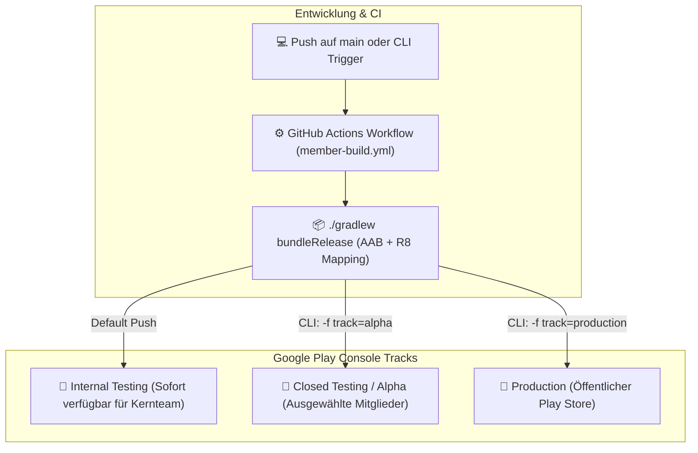

# 🚀 Google Play Console — CLI- & CI/CD-Deployment Guide

Dieses Dokument beschreibt die Schritt-für-Schritt-Einrichtung, um neue App-Versionen von **SprachCafé Mitglied** (`org.sprachcafe.member`) vollautomatisch oder CLI-gesteuert in die Google Play Console zu veröffentlichen.

---

## 🏗️ Architektur & Track-Modell



---

## 🔑 1. Einmalige Einrichtung: Service-Account & Secret

### Schritt 1: Google Play Developer API aktivieren
1. Öffne die [Google Cloud Console](https://console.cloud.google.com/) mit dem Inhaberkonto deines Play-Entwicklerkontos.
2. Wähle das verknüpfte Google Play-Projekt aus.
3. Aktiviere die **Google Play Android Developer API**.

### Schritt 2: Service Account (Dienstkonto) erstellen
1. Gehe in der Google Cloud Console auf **IAM & Verwaltung ➔ Dienstkonten**.
2. Klicke auf **Dienstkonto erstellen**.
   - **Name:** `play-console-publisher`
   - **Rolle:** Optional (die eigentlichen Berechtigungen werden in der Play Console vergeben).
3. Klicke auf das neu erstellte Dienstkonto ➔ Tab **Schlüssel** ➔ **Schlüssel hinzufügen ➔ Neuen Schlüssel erstellen ➔ JSON**.
4. Lade die `.json`-Schlüsseldatei herunter und bewahre sie sicher auf.

### Schritt 3: Dienstkonto in der Google Play Console autorisieren
1. Öffne die [Google Play Console](https://play.google.com/console).
2. Navigiere zu **Entwicklerkonto ➔ API-Zugriff**.
3. Das neu erstellte Dienstkonto wird dort aufgeführt. Klicke daneben auf **Zugriff gewähren**.
4. Wähle unter **App-Berechtigungen** die App **SprachCafé Mitglied** (`org.sprachcafe.member`) aus.
5. Weise unter **Kontoberechtigungen** mindestens zu:
   - ✅ *Releases für Test-Tracks erstellen und verwalten* (für Internal / Alpha)
   - ✅ *Releases für Produktions-Tracks erstellen und verwalten* (für Store-Releases)
6. Klicke auf **Nutzer einladen / Berechtigungen speichern**.

### Schritt 4: Secret in GitHub hinterlegen
1. Öffne das GitHub-Repository [fuchstv/sprachcafe-member](https://github.com/fuchstv/sprachcafe-member).
2. Gehe zu **Settings ➔ Secrets and variables ➔ Actions ➔ New repository secret**.
3. Name: `PLAY_SERVICE_ACCOUNT_KEY`
4. Wert: Kopiere den **gesamten Inhalt der JSON-Schlüsseldatei** hinein.
5. Klicke auf **Add secret**.

---

## 💻 2. CLI-gesteuertes Deployment

Sobald das Secret hinterlegt ist, kannst du Releases direkt per GitHub CLI (`gh`) oder Git-Push steuern:

### A. Schneller Test-Release (Internal Track)
Veröffentlicht den aktuellen Stand in Sekunden auf dem internen Test-Track:
```bash
gh workflow run member-build.yml -f track=internal
```
*(Wird auch bei jedem regulären `git push` auf den `main`-Branch automatisch ausgeführt)*

### B. Closed Testing (Alpha-Tester)
Verteilt die Version an die geschlossene Testergruppe (z. B. Vorstand & aktive Mitglieder):
```bash
gh workflow run member-build.yml -f track=alpha
```

### C. Live-Store Release (Production)
Veröffentlicht die Version als volles Produktions-Release im Google Play Store:
```bash
gh workflow run member-build.yml -f track=production
```

### D. Release als Entwurf vorbereiten (Draft)
Möchtest du die Version vor dem Ausrollen im Play Console Webinterface manuell prüfen:
```bash
gh workflow run member-build.yml -f track=production -f status=draft
```

### E. Status der Pipeline in der CLI verfolgen
```bash
# Aktuellen Lauf anzeigen
gh run list --workflow=member-build.yml

# Live-Log mitverfolgen
gh run watch
```
