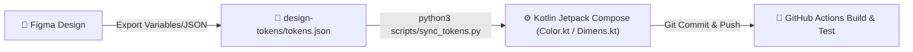

# 🎨 SprachCafé Polnisch e.V. — Figma & Design System Guide

Dieser Leitfaden beschreibt, wie die UX-Designerin die aktuellen Komponenten der Android-Mitglieder-App in **Figma** importiert, weiterentwickelt und Änderungen synchron mit dem Codebase hält.

---

## 🚀 1. Schnellstart: In Figma importieren

### A. Design-Tokens & Variablen (Farben, Abstände, Radien)
In diesem Ordner liegt die Datei [`figma-variables.json`](file:///home/ubuntu/sprachcafe-member/design-tokens/figma/figma-variables.json).

1. Öffne dein Projekt in Figma.
2. Installiere bzw. öffne das Figma-Plugin **"Variables Import / Export"** oder **"Tokens Studio for Figma"**.
3. Importiere `figma-variables.json`.
4. Du erhältst sofort zwei strukturierte Collections:
   - **SprachCafe / Brand & UI:** `Brand/Red`, `Brand/DarkRed`, `Brand/Gold`, `Brand/Cream`, `Neutral/*`, `Radius/*`, `Spacing/*`.
   - **SprachCafe / Member Tiers (Modes):** `Silver`, `Gold`, `Platinum`, `Company` mit den jeweiligen Verläufen (`Card/GradientStart`, `Card/GradientEnd`) und Labels.

### B. Vektor-Komponenten & Ausweise (SVGs)
In diesem Verzeichnis liegen native Vektor-SVGs aller Ausweiskarten und UI-Blöcke:
- [`card-silver.svg`](file:///home/ubuntu/sprachcafe-member/design-tokens/figma/card-silver.svg) (Silver-Ausweis)
- [`card-gold.svg`](file:///home/ubuntu/sprachcafe-member/design-tokens/figma/card-gold.svg) (Gold-Ausweis)
- [`card-platinum.svg`](file:///home/ubuntu/sprachcafe-member/design-tokens/figma/card-platinum.svg) (Platinum-Ausweis)
- [`card-company.svg`](file:///home/ubuntu/sprachcafe-member/design-tokens/figma/card-company.svg) (Firmen-Ausweis)
- [`benefits-grid.svg`](file:///home/ubuntu/sprachcafe-member/design-tokens/figma/benefits-grid.svg) (Vorteilskacheln)

**Vorgehen:**
1. Ziehe die SVG-Dateien per Drag & Drop direkt auf deine Figma-Canvas.
2. Alle Elemente (Kartenrahmen, Badge, Texte, Emojis, Schatten, Verläufe) werden als **voll editierbare Vektorebenen** importiert.
3. Markiere den Rahmen und wähle **Create Component** (Ctrl+Alt+K bzw. Cmd+Option+K).
4. Verknüpfe die Farben mit den importierten Figma-Variablen.

---

## 🔄 2. Synchronisations-Workflow (Figma ➔ GitHub ➔ Android App)

Um Design und Code synchron zu halten, gilt die **Single Source of Truth**-Strategie:



### Wie eine Design-Änderung in die App gelangt:
1. **Änderung in Figma:** Designerin passt z. B. einen Farbton, Radius oder Abstand an.
2. **Token-Update:** Die Werte werden in [`design-tokens/tokens.json`](file:///home/ubuntu/sprachcafe-member/design-tokens/tokens.json) aktualisiert.
3. **Generierung:** Führe im Repository aus:
   ```bash
   python3 scripts/sync_tokens.py
   ```
   Dies aktualisiert automatisch:
   - [`app/src/main/java/org/sprachcafe/member/ui/theme/Color.kt`](file:///home/ubuntu/sprachcafe-member/app/src/main/java/org/sprachcafe/member/ui/theme/Color.kt)
   - [`app/src/main/java/org/sprachcafe/member/ui/theme/Dimens.kt`](file:///home/ubuntu/sprachcafe-member/app/src/main/java/org/sprachcafe/member/ui/theme/Dimens.kt)
4. **Validierung im CI:** In GitHub Actions prüft `python3 scripts/sync_tokens.py --check`, ob Design-Tokens und Kotlin-Code synchron sind.
